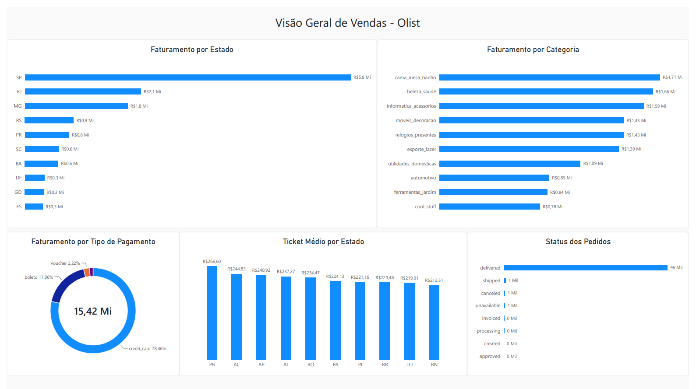

# sql-estudos
Estudos e exercícios práticos de SQL para Análise de Dados utilizando MySQL.

# Olist - E-commerce Analytics

Projeto desenvolvido para extrair inteligência de negócios de um banco de dados relacional e apresentar os resultados em um painel executivo (dashboard).

## 💡 Principais Insights de Negócio
- **O Paradoxo do Ticket Médio:** SP lidera o faturamento absoluto, mas a Paraíba (PB) possui o maior Ticket Médio do Brasil (R$ 266,60), revelando oportunidades no Nordeste.
- **Domínio do Cartão de Crédito:** Quase 80% (R$ 15,42 Mi) de todo o faturamento ocorre via cartão de crédito.
- **Saúde Logística:** A operação possui altíssima confiabilidade, com 96 mil pedidos entregues, esmagando a proporção de cancelamentos.

## 📈 O Dashboard

## Estrutura do Projeto (Olist)
📄 `01_desempenho_produtos.sql`: Faturamento por Categoria (Top Categorias).
📄 `02_faturamento_estado.sql`: Receita Total por Estado (Top 10).
📄 `03_forma_pagamento.sql`: Representatividade financeira de cada método.
📄 `04_ticket_medio_estado.sql`: Ticket Médio cruzado por UF.
📄 `05_dado_operacional.sql`: Volume absoluto de pacotes por status.

## Tecnologias
- MySQL
- Power BI (Power Query, Filtros Top N, UX/UI)
- Git e GitHub

---

# Comércio Fácil

Projeto desenvolvido para praticar SQL durante os estudos de Análise de Dados.

## Conceitos utilizados

- SELECT
- WHERE
- ORDER BY
- JOIN
- CASE
- DISTINCT
- SUBQUERY
- IN
- LIKE
- NOT IN

## Estrutura

📄 01_create_tables.sql
Criação das tabelas.

📄 02_insert_data.sql
Carga de dados fictícios.

📄 03_exercicios.sql
Resolução dos exercícios propostos.

---

# Clínica Médica

Projeto desenvolvido para praticar SQL utilizando um cenário fictício de uma clínica médica.

## Objetivo

Simular consultas realizadas em uma clínica para praticar consultas SQL aplicadas a problemas de negócio.

## Estrutura do Projeto

📄 01_create_tables.sql
- Criação das tabelas do banco de dados.

📄 02_insert_data.sql
- Inserção de dados fictícios para testes.

📄 03_exercicios.sql
- Resolução dos exercícios propostos.

## Tabelas

- TB_PACIENTES
- TB_MEDICOS
- TB_CONSULTAS

## Conceitos SQL praticados

- SELECT, WHERE, ORDER BY, INNER JOIN, CASE, DISTINCT, SUBQUERY, NOT IN, IN, LIKE.

## Exercícios resolvidos

- Consultas com filtros e ordenação.
- Médicos sem consultas registradas.
- Classificação das consultas por faixa de custo.
- Relatórios utilizando JOIN entre pacientes, médicos e consultas.

## Competências desenvolvidas

- Modelagem básica de banco de dados
- Relacionamento entre tabelas
- Construção de consultas SQL
- Interpretação de problemas de negócio
- Organização de scripts SQL
- Versionamento com Git e GitHub
